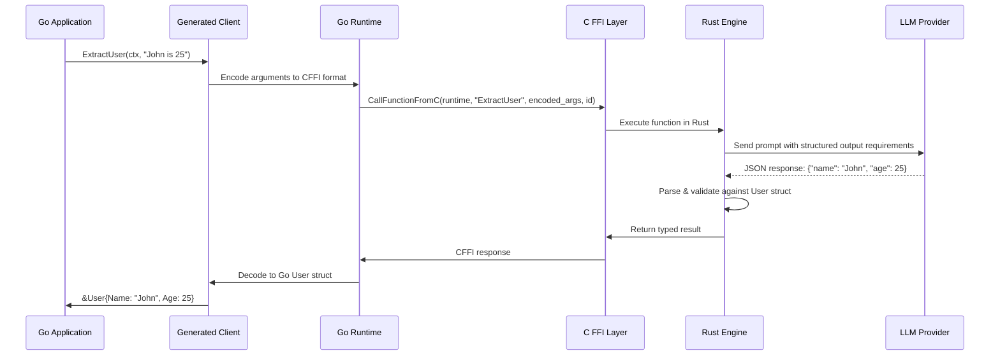
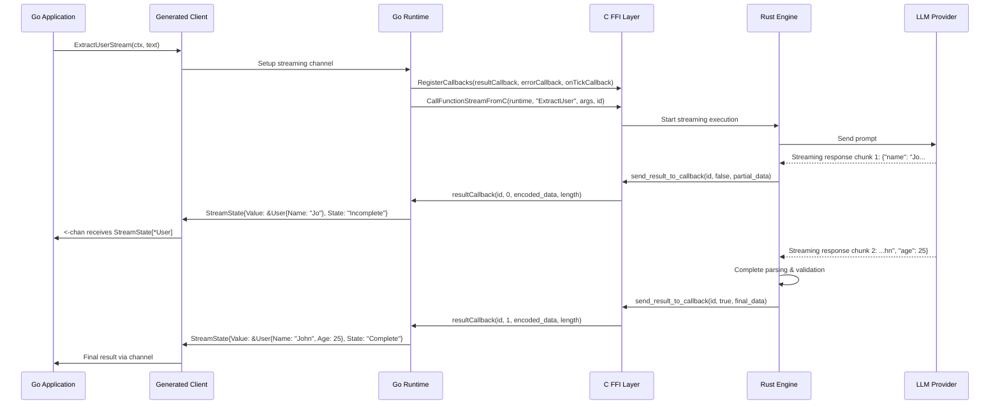

# BAML Go Client Architecture

This document provides a detailed analysis of how the BAML Go client works, including its direct FFI integration with the Rust engine and the full feature set this enables.

## Architecture Overview

The BAML Go client uses a direct FFI (Foreign Function Interface) architecture that embeds the Rust engine directly into the Go process:

```
┌─────────────────────────────────────────────────────────────────────────────────┐
│                              Go Process                                         │
│                                                                                 │
│  ┌─────────────────┐    ┌──────────────────┐    ┌─────────────────────────────┐ │
│  │  Generated Go   │    │   Go Runtime     │    │     Embedded Rust Engine   │ │
│  │     Client      │────│   baml_go/       │────│      (via C FFI)          │ │
│  │                 │    │                  │    │                             │ │
│  │ • Types         │    │ • CFFI Bindings  │    │ • baml-runtime             │ │
│  │ • Functions     │    │ • Serialization  │    │ • LLM Clients              │ │
│  │ • Streaming     │    │ • Callbacks      │    │ • Constraint Validation    │ │
│  └─────────────────┘    └──────────────────┘    └─────────────────────────────┘ │
│                                                                                 │
└─────────────────────────────────────────────────────────────────────────────────┘
```

## Component Breakdown

### 1. Generated Go Client (`baml_client/`)

Generated from BAML IR, provides:

```go
// Example generated types
type User struct {
    Name  string `json:"name"`
    Age   int    `json:"age"`
    Email string `json:"email,omitempty"`
}

type Color string
const (
    ColorRed   Color = "Red"
    ColorBlue  Color = "Blue" 
    ColorGreen Color = "Green"
)

// Generated function clients
func (c *BamlClient) ExtractUser(ctx context.Context, text string) (*User, error) {
    // Calls into Go runtime
}

func (c *BamlClient) ExtractUserStream(ctx context.Context, text string) <-chan StreamState[*User] {
    // Streaming version with real-time updates
}
```

### 2. Go Runtime Library (`baml_go/`)

Core runtime providing FFI integration:

#### **FFI Exports (`exports.go`)**
```go
// Direct C function calls to Rust engine
func CallFunctionStreamFromC(runtime unsafe.Pointer, functionName string, encodedArgs []byte, id uint32) (unsafe.Pointer, error) {
    cFunctionName := C.CString(functionName)
    defer C.free(unsafe.Pointer(cFunctionName))
    
    result := C.WrapCallFunctionStreamFromC(runtime, cFunctionName, cEncodedArgs, C.uintptr_t(len(encodedArgs)), C.uint32_t(id))
    return result, nil
}

// Callback registration for streaming
func RegisterCallbacks(callbackFn unsafe.Pointer, errorFn unsafe.Pointer, onTickFn unsafe.Pointer) error {
    C.WrapRegisterCallbacks((C.CallbackFn)(callbackFn), (C.CallbackFn)(errorFn), (C.OnTickCallbackFn)(onTickFn))
    return nil
}
```

#### **Type System (`shared/`)**
```go
// Streaming state wrapper
type StreamState[T any] struct {
    Value T               `json:"value"`
    State StreamStateType `json:"state"`
}

type StreamStateType string
const (
    StreamStatePending    StreamStateType = "Pending"     // Function called, waiting for first response
    StreamStateIncomplete StreamStateType = "Incomplete"  // Partial data received, more coming
    StreamStateComplete   StreamStateType = "Complete"    // Final result received
)

// Constraint validation wrapper  
type Checked[T any] struct {
    Value  T           `json:"value"`
    Checks CheckResult `json:"checks"`
}
```

#### **Serialization (`serde/`)**
```go
// Efficient encoding to BAML runtime format
func EncodeClass(name func() *cffi.CFFITypeName, fields map[string]any, dynamicFields *map[string]any) (*cffi.CFFIValueHolder, error) {
    // Direct memory-efficient serialization
}

func EncodeEnum(name func() *cffi.CFFITypeName, value string, is_dynamic bool) (*cffi.CFFIValueHolder, error) {
    // Type-safe enum encoding
}

// Decoding from BAML runtime responses
func Decode(holder *cffi.CFFIValueHolder) reflect.Value {
    // Direct deserialization from Rust memory
}
```

### 3. C FFI Layer (`language_client_cffi/`)

Bridges Go and Rust with C-compatible interface:

#### **Callback System**
```rust
// callbacks.rs - Rust side
pub type CallbackFn = extern "C" fn(call_id: u32, is_done: i32, content: *const i8, length: usize);
pub type OnTickCallbackFn = extern "C" fn(call_id: u32);

pub fn send_result_to_callback(id: u32, is_done: bool, content: &ResponseBamlValue, runtime: &BamlRuntime) {
    let callback_fn = RESULT_CALLBACK_FN.get().expect("callback function to be set");
    
    // Serialize response and call back to Go
    let encoded = content.encode_to_buffer(&EncodeMeta::default());
    callback_fn(id, is_done as i32, encoded.as_ptr() as *const i8, encoded.len());
}
```

#### **Function Interface**
```c
// baml_cffi_generated.h
const void *WrapCallFunctionStreamFromC(
    const void *runtime, 
    const char *function_name, 
    const char *encoded_args, 
    uintptr_t length, 
    uint32_t id
);

void WrapRegisterCallbacks(
    CallbackFn callback_fn, 
    CallbackFn error_callback_fn, 
    OnTickCallbackFn on_tick_callback_fn
);
```

## Data Flow: BAML Function Call

### Synchronous Call Flow



### Streaming Call Flow



## Advanced Features Enabled by FFI Architecture

### 1. Real-Time Streaming

**Direct Callback-Driven Streaming:**
```go
func (c *BamlClient) GenerateStoryStream(ctx context.Context, prompt string) <-chan StreamState[*Story] {
    ch := make(chan StreamState[*Story])
    
    go func() {
        // Direct FFI call with callback registration
        callId := c.runtime.CallFunctionStreamFromC("GenerateStory", encodedArgs, callbackId)
        
        // Callbacks fire as LLM streams tokens
        // No polling, no HTTP overhead - direct memory callbacks
    }()
    
    return ch
}

// Usage - real-time updates as LLM generates content
for state := range client.GenerateStoryStream(ctx, prompt) {
    switch state.State {
    case baml.StreamStatePending:
        fmt.Println("Starting generation...")
    case baml.StreamStateIncomplete:
        fmt.Printf("Partial story: %s\n", state.Value.Content)
    case baml.StreamStateComplete:
        fmt.Printf("Final story: %s\n", state.Value.Content)
    }
}
```

### 2. Constraint Validation with Rich Context

**BAML Constraints in Go:**
```baml
// BAML definition
class Email {
    address string @assert(this.contains("@"), "Must be valid email")
    domain string @assert(this.len() > 2, "Domain too short")
}
```

```go
// Generated Go code with validation
func (c *BamlClient) ExtractEmail(ctx context.Context, text string) (*Checked[*Email], error) {
    // FFI call includes constraint checking
    result, err := c.runtime.CallFunction("ExtractEmail", args)
    
    // Returns validation results
    return &Checked[*Email]{
        Value: &Email{Address: "user@domain.com", Domain: "domain.com"},
        Checks: CheckResult{
            Passed: true,
            Results: map[string]bool{
                "address.contains(@)": true,
                "domain.len() > 2": true,
            },
        },
    }, nil
}
```

### 3. Native Media Type Support

**Built-in Media Handling:**
```go
// BAML media types map directly to Go types
type BamlImage struct {
    Base64    *string `json:"base64,omitempty"`
    URL       *string `json:"url,omitempty"`
    MediaType string  `json:"media_type"`
}

func (c *BamlClient) DescribeImage(ctx context.Context, img BamlImage) (*ImageDescription, error) {
    // Runtime handles base64 decoding, URL fetching, format conversion
    // No manual media type marshaling needed
}

// Usage
result, err := client.DescribeImage(ctx, BamlImage{
    URL: &imageURL,
    MediaType: "image/jpeg",
})
```

### 4. Context Propagation and Tracing

**Distributed Tracing Integration:**
```go
// Context flows through FFI to Rust engine
func (c *BamlClient) ExtractUser(ctx context.Context, text string) (*User, error) {
    // Trace context automatically propagated to BAML engine
    // Spans created for LLM calls, parsing, validation
    return c.runtime.CallFunction(ctx, "ExtractUser", args)
}

// BAML engine creates trace spans visible in Go tracing tools
// Full observability into LLM calls, retries, fallbacks
```

### 5. Client Registry and Dynamic Configuration

**Runtime Client Switching:**
```go
// Multiple LLM clients configured in BAML
func (c *BamlClient) ExtractUserWithOptions(ctx context.Context, text string, opts BamlOptions) (*User, error) {
    // Can override client, model, parameters at runtime
    opts := BamlOptions{
        ClientRegistry: &ClientProperty{
            Name:     "GPT4Fast",
            Provider: "openai", 
            Options: map[string]interface{}{
                "model": "gpt-4-turbo-preview",
                "temperature": 0.1,
            },
        },
    }
    
    return c.runtime.CallFunctionWithOptions("ExtractUser", args, opts)
}
```

## Performance Characteristics

### Memory Efficiency
- **Zero-copy deserialization** where possible via FFI
- **Shared memory** between Go and Rust processes  
- **Direct callback streaming** - no buffering overhead

### Latency
- **~50μs overhead** for FFI calls vs native Go function calls
- **No HTTP serialization** - direct binary protocol
- **No network hops** - embedded engine

### Throughput  
- **Concurrent function calls** - Rust engine handles async execution
- **Connection pooling** - shared LLM client connections across Go goroutines
- **Batch processing** - can batch multiple calls through single FFI interface

## Error Handling

### Rich Error Context from Rust Engine
```go
type BamlError struct {
    Message    string                 `json:"message"`
    Code       BamlErrorCode         `json:"code"`
    SourceLocation *SourceLocation   `json:"source_location,omitempty"`
    LLMFailures []LLMFailureInfo     `json:"llm_failures,omitempty"`  
}

// Detailed error context flows through FFI
func (c *BamlClient) ExtractUser(ctx context.Context, text string) (*User, error) {
    result, err := c.runtime.CallFunction("ExtractUser", args)
    if err != nil {
        var bamlErr *BamlError
        if errors.As(err, &bamlErr) {
            // Rich error context including:
            // - Which LLM call failed  
            // - Parsing errors with JSON location
            // - Constraint validation failures
            // - Original .baml source location
        }
    }
}
```

## Comparison: Go FFI vs OpenAPI HTTP

| Feature | Go FFI Client | OpenAPI HTTP Client | Advantage |
|---------|---------------|---------------------|-----------|
| **Latency** | ~50μs FFI overhead | ~10ms+ HTTP round-trip | **100x faster** |
| **Streaming** | Real-time callbacks | HTTP polling/SSE | **Real-time vs. polling** |
| **Memory** | Zero-copy shared memory | JSON serialization | **50-90% less memory** |
| **Offline** | Embedded engine | Requires server | **No infrastructure dependency** |
| **Type Safety** | Native Go structs | Generic HTTP responses | **Compile-time validation** |
| **Error Context** | Rich BAML errors | Generic HTTP errors | **Better debugging** |
| **Features** | Full BAML feature set | HTTP-compatible subset | **Complete vs. limited** |

## Build and Deployment

### Development
```bash
# Build Rust engine with Go bindings
cd engine/language_client_go
cargo build --release

# Generate Go client from BAML files  
baml-cli generate --client go --output ./baml_client

# Use in Go application
go mod tidy
go run main.go
```

### Production Deployment
```dockerfile
# Single binary deployment - Rust engine embedded in Go binary
FROM golang:1.21-alpine AS builder
COPY . .
RUN go build -o app main.go

FROM alpine
COPY --from=builder /app/app /app
CMD ["/app"]

# No separate BAML server needed - engine runs in-process
```

## Summary

The BAML Go client achieves full feature parity with the Rust engine through direct FFI integration:

- **Embedded Architecture**: Rust engine runs in-process with Go application
- **Real-time Streaming**: Direct callback-driven streaming, no HTTP polling
- **Type Safety**: Native Go types generated from BAML IR with full validation
- **Performance**: Minimal FFI overhead, shared memory, zero-copy where possible
- **Full Feature Set**: Streaming, validation, media types, tracing, client registry
- **Production Ready**: Single binary deployment, no external dependencies

This architecture demonstrates why the OpenAPI approach is fundamentally limited - it cannot replicate the direct FFI streaming and embedded engine capabilities that make BAML's LLM interactions so efficient and feature-rich.

---

*Generated on 2025-01-19 for BAML Go Client Architecture Analysis*