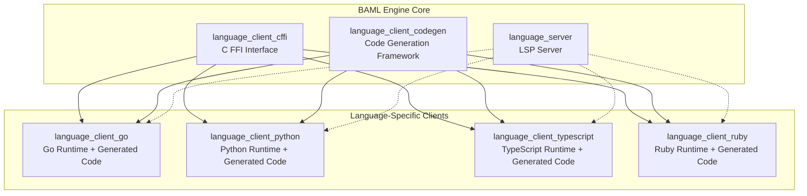
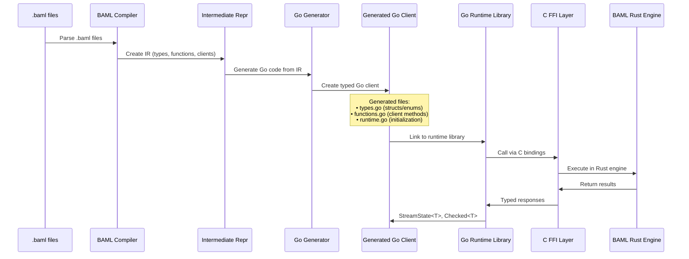
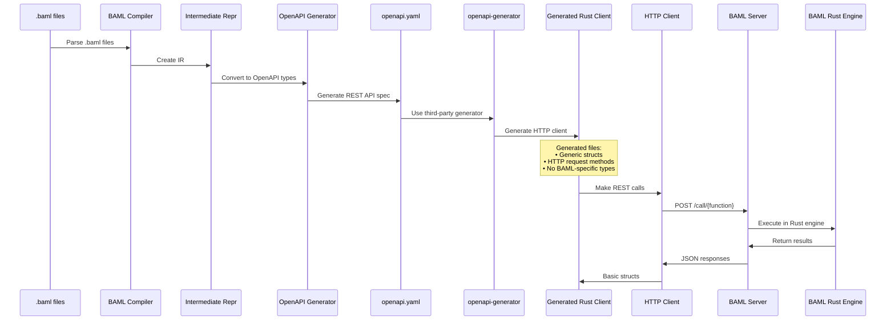

# BAML Rust Client Analysis

This document analyzes the current state of Rust support in BAML and compares different approaches for generating Rust clients.

## Current Architecture Overview

BAML has a multi-layered client generation architecture:

```
┌─────────────────────────────────────────────────────────────┐
│                    BAML Source (.baml)                     │
└─────────────────────┬───────────────────────────────────────┘
                      │
                      ▼
┌─────────────────────────────────────────────────────────────┐
│              BAML Compiler & IR                            │
│           (Intermediate Representation)                    │
└─────────────┬───────────────────────┬─────────────────────┘
              │                       │
              ▼                       ▼
┌─────────────────────┐     ┌─────────────────────────────────┐
│  Direct Generators  │     │      OpenAPI Generator         │
│                     │     │                                │
│ ├── Go              │     │ Generates openapi.yaml         │
│ ├── Python          │     │                                │
│ ├── TypeScript      │     │                                │
│ └── Ruby            │     │                                │
└─────────────┬───────┘     └─────────────────┬───────────────┘
              │                               │
              ▼                               ▼
┌─────────────────────┐     ┌─────────────────────────────────┐
│   Native Clients    │     │    Third-party Generators      │
│                     │     │                                │
│ • Full BAML features│     │ • openapi-generator (Rust)     │
│ • Runtime integration│    │ • Limited HTTP-only clients    │
│ • Type safety       │     │ • Generic REST API access      │
└─────────────────────┘     └─────────────────────────────────┘
```

## Language Client Components

### Core Components



### Component Responsibilities

| Component | Purpose |
|-----------|---------|
| `language_client_cffi` | C FFI bindings for cross-language communication with Rust engine |
| `language_client_codegen` | Shared code generation framework and templates |
| `language_client_go` | Go-specific runtime library and CFFI bindings |
| `language_client_python` | Python-specific runtime library using PyO3/maturin |
| `language_client_ruby` | Ruby-specific runtime library and gem packaging |
| `language_client_typescript` | TypeScript/Node.js runtime library using NAPI |
| `language_server` | LSP server for IDE integration and tooling |

## BAML Compilation Flow: Go Example



### Go Client Features

The direct Go client provides:

#### **Type System**
- **Native Go structs** for BAML classes
- **Go enums** with type safety
- **Union types** with proper discrimination
- **Generic wrappers**: `StreamState<T>`, `Checked<T>`

#### **Runtime Features**
```go
// Streaming support
type StreamState[T any] struct {
    Value T               `json:"value"`
    State StreamStateType `json:"state"`  // Pending|Incomplete|Complete
}

// Constraint validation
type Checked[T any] struct {
    Value  T           `json:"value"`
    Checks CheckResult `json:"checks"`
}

// Media type handling
func HandleBamlImage(img BamlImage) {
    switch img.Type {
    case "base64":
        // Handle base64 data
    case "url":
        // Handle URL reference
    }
}
```

#### **Direct Engine Integration**
- **CFFI bindings** to Rust engine via `language_client_cffi`
- **Context propagation** for tracing and logging
- **Client registry** for runtime configuration
- **Error handling** with rich BAML error types

## OpenAPI Alternative: Limitations

### OpenAPI Generation Flow



### Missing Features in OpenAPI Rust Client

| Feature | Direct Go Client | OpenAPI Rust Client | Impact |
|---------|------------------|---------------------|--------|
| **Streaming** | ✅ `StreamState<T>` | ❌ HTTP only | No real-time LLM streaming |
| **Validation** | ✅ `Checked<T>` wrapper | ⚠️ Separate objects | Awkward validation handling |
| **Media Types** | ✅ Native `BamlImage` etc. | ⚠️ Generic JSON | Manual serialization needed |
| **Type Safety** | ✅ Full IR mapping | ❌ Lossy conversion | Runtime errors vs compile-time |
| **Error Handling** | ✅ Rich BAML errors | ❌ Generic HTTP errors | Poor debugging experience |
| **Performance** | ✅ Direct CFFI calls | ❌ HTTP overhead | Latency + serialization costs |
| **Offline Usage** | ✅ Embedded engine | ❌ Requires server | Infrastructure dependency |

### OpenAPI Type Mapping Limitations

```yaml
# What gets lost in OpenAPI translation:

# BAML Union Type:
# union Status = Success | Error { message: string }

# Becomes generic OpenAPI:
Status:
  oneOf:
    - type: string
      enum: [Success]  
    - type: object
      properties:
        message:
          type: string

# Lost: Type discrimination, variant names, compile-time safety
```

## Rust Client Implementation Approaches

### Option 1: OpenAPI Generation (Current Workaround)
**Pros:**
- ✅ Can be implemented today
- ✅ Uses existing OpenAPI tooling
- ✅ Standard REST client patterns

**Cons:**
- ❌ ~60% feature loss (streaming, validation, media)
- ❌ HTTP-only, no offline usage
- ❌ Poor type safety for complex BAML types
- ❌ Extra infrastructure dependency

### Option 2: Native Rust Generator (Recommended)
**Implementation Required:**
```
1. Create generators/languages/rust/
   ├── src/
   │   ├── lib.rs (RustLanguageFeatures)
   │   ├── generate_types.rs
   │   ├── ir_to_rust/
   │   │   ├── classes.rs
   │   │   ├── enums.rs  
   │   │   ├── functions.rs
   │   │   └── unions.rs
   │   └── _templates/
   │       ├── client.rs.j2
   │       ├── types.rs.j2
   │       └── runtime.rs.j2

2. Create language_client_rust/
   ├── Cargo.toml
   ├── src/
   │   ├── lib.rs
   │   ├── runtime.rs (CFFI bindings)
   │   ├── types/
   │   │   ├── stream_state.rs
   │   │   ├── checked.rs
   │   │   └── media.rs
   │   └── errors.rs

3. Add GeneratorOutputType::Rust to baml-types
```

**Benefits:**
- ✅ Full BAML feature parity with Go/Python/TypeScript
- ✅ Native Rust types and idioms
- ✅ Direct engine integration via CFFI
- ✅ Streaming, validation, media types
- ✅ Compile-time type safety
- ✅ Offline usage capability

## Recommendation

For production Rust usage, implement **Option 2: Native Rust Generator**. The OpenAPI approach is too limited for serious BAML applications and loses most of the framework's value proposition.

The native approach would provide:
- First-class Rust support matching other languages
- Full access to BAML's advanced features
- Idiomatic Rust code generation
- Production-ready performance and reliability

## Current Status

**Rust Support:** ❌ Not Available  
**Workaround:** ⚠️ OpenAPI generation (limited)  
**Recommendation:** 🚧 Implement native Rust generator

---

*Generated on 2025-01-19 for BAML Engine Analysis*