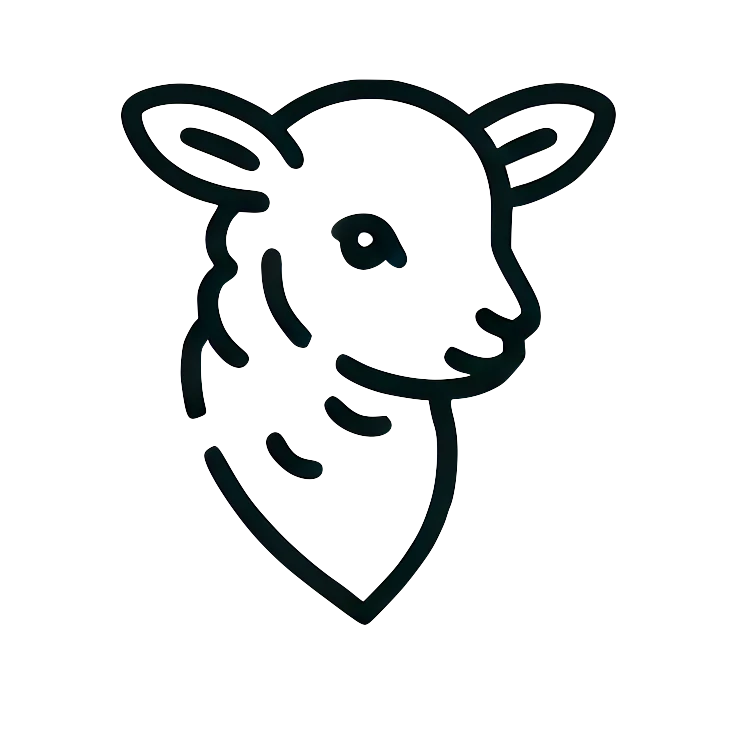

<div align="center">
<a href="https://boundaryml.com?utm_source=github" target="_blank" rel="noopener noreferrer">
  <picture>
    <source media="(prefers-color-scheme: dark)" srcset="fern/assets/baml-lamb-white.png">
    
  </picture>
</a>

</div>

<div align="center">

[](https://pypi.org/project/baml-py/)

## BAML: Basically a Made-up Language
<h4>

[Homepage](https://www.boundaryml.com/) | [Docs](https://docs.boundaryml.com) | [BAML AI Chat](https://www.boundaryml.com/chat) | [Discord](https://discord.gg/BTNBeXGuaS)


</h4>


</div>

BAML is a simple prompting language for building reliable **AI workflows and agents**.

BAML makes prompt engineering easy by turning it into _schema engineering_ -- where you mostly focus on the models of your prompt -- to get more reliable outputs. 
You don't need to write your whole app in BAML, only the prompts! You can wire-up your LLM Functions in any language of your choice! See our quickstarts for [Python](https://docs.boundaryml.com/guide/installation-language/python), [TypeScript](https://docs.boundaryml.com/guide/installation-language/typescript), [Ruby](https://docs.boundaryml.com/guide/installation-language/ruby) and [Go, and more](https://docs.boundaryml.com/guide/installation-language/rest-api-other-languages).

BAML comes with all batteries included -- with full typesafety, streaming, retries, wide model support, even when they don't support native [tool-calling APIs](#enable-reliable-tool-calling-with-any-model-even-when-they-dont-support-it)

**Try BAML**: [Prompt Fiddle](https://www.promptfiddle.com) • [Interactive App Examples](https://baml-examples.vercel.app/)


## The core BAML principle: LLM Prompts are functions

The fundamental building block in BAML is a function. Every prompt is a function that takes in parameters and returns a type.

```rust
function ChatAgent(message: Message[], tone: "happy" | "sad") -> string
```

Every function additionally defines which models it uses and what its prompt is.

```rust
function ChatAgent(message: Message[], tone: "happy" | "sad") -> StopTool | ReplyTool {
    client "openai/gpt-4o-mini"

    prompt #"
        Be a {{ tone }} bot.

        {{ ctx.output_format }}

        
        {{ _.role(m.role) }}
        {{ m.content }}
        
    "#
}

class Message {
    role string
    content string
}

class ReplyTool {
  response string
}

class StopTool {
  action "stop" @description(#"
    when it might be a good time to end the conversation
  "#)
}
```

## BAML Functions can be called from any language
Below we call the ChatAgent function we defined in BAML through Python. BAML's Rust compiler generates a "baml_client" to access and call them.

```python
from baml_client import b
from baml_client.types import Message, StopTool

messages = [Message(role="assistant", content="How can I help?")]

while True:
  print(messages[-1].content)
  user_reply = input()
  messages.append(Message(role="user", content=user_reply))
  tool = b.ChatAgent(messages, "happy")
  if isinstance(tool, StopTool):
    print("Goodbye!")
    break
  else:
    messages.append(Message(role="assistant", content=tool.response))
```
You can write any kind of agent or workflow using chained BAML functions. An agent is a while loop that calls a Chat BAML Function with some state.

And if you need to stream, add a couple more lines:
```python
stream = b.stream.ChatAgent(messages, "happy")
# partial is a Partial type with all Optional fields
for tool in stream:
    if isinstance(tool, StopTool):
      ...
    
final = stream.get_final_response()
```
And get fully type-safe outputs for each chunk in the stream.

## Test prompts 10x faster, right in your IDE
BAML comes with native tooling for VSCode (jetbrains + neovim coming soon). 

**Visualize full prompt (including any multi-modal assets), and the API request**. BAML gives you full transparency and control of the prompt.


**Using AI is all about iteration speed.**

If testing your pipeline takes 2 minutes, you can only test 10 ideas in 20 minutes.

If you reduce it to 5 seconds, you can test 240 ideas in the same amount of time.


The playground also allows you to run tests in parallel -- for even faster iteration speeds 🚀.

No need to login to websites, and no need to manually define json schemas.

## Enable reliable tool-calling with any model
BAML works even when the models don't support native tool-calling APIs. We created the SAP (schema-aligned parsing) algorithm to support the flexible outputs LLMs can provide, like markdown within a JSON blob or chain-of-thought prior to answering. [Read more about SAP](https://www.boundaryml.com/blog/schema-aligned-parsing)

With BAML, your structured outputs work in Day-1 of a model release. No need to figure out whether a model supports parallel tool calls, or whether it supports recursive schemas, or `anyOf` or `oneOf` etc.

See it in action with: **[Deepseek-R1](https://www.boundaryml.com/blog/deepseek-r1-function-calling)** and [OpenAI O1](https://www.boundaryml.com/blog/openai-o1).


## Switch from 100s of models in a couple lines
```diff
function Extract() -> Resume {
+  client openai/o3-mini
  prompt #"
    ....
  "#
}
```
[Retry policies](https://docs.boundaryml.com/ref/llm-client-strategies/retry-policy) • [fallbacks](https://docs.boundaryml.com/ref/llm-client-strategies/fallback) • [model rotations](https://docs.boundaryml.com/ref/llm-client-strategies/round-robin). All statically defined.

Want to do pick models at runtime? Check out the [Client Registry](https://docs.boundaryml.com/guide/baml-advanced/llm-client-registry).

We support: [OpenAI](https://docs.boundaryml.com/ref/llm-client-providers/open-ai) • [Anthropic](https://docs.boundaryml.com/ref/llm-client-providers/anthropic) • [Gemini](https://docs.boundaryml.com/ref/llm-client-providers/google-ai-gemini) • [Vertex](https://docs.boundaryml.com/ref/llm-client-providers/google-vertex) • [Bedrock](https://docs.boundaryml.com/ref/llm-client-providers/aws-bedrock) • [Azure OpenAI](https://docs.boundaryml.com/ref/llm-client-providers/open-ai-from-azure) • [Anything OpenAI Compatible](https://docs.boundaryml.com/ref/llm-client-providers/openai-generic) ([Ollama](https://docs.boundaryml.com/ref/llm-client-providers/openai-generic-ollama), [OpenRouter](https://docs.boundaryml.com/ref/llm-client-providers/openai-generic-open-router), [VLLM](https://docs.boundaryml.com/ref/llm-client-providers/openai-generic-v-llm), [LMStudio](https://docs.boundaryml.com/ref/llm-client-providers/openai-generic-lm-studio), [TogetherAI](https://docs.boundaryml.com/ref/llm-client-providers/openai-generic-together-ai), and more)

## Build beautiful streaming UIs
BAML generates a ton of utilities for NextJS, Python (and any language) to make streaming UIs easy.


BAML's streaming interfaces are fully type-safe. Check out the [Streaming Docs](https://docs.boundaryml.com/guide/baml-basics/streaming), and our [React hooks](https://docs.boundaryml.com/guide/framework-integration/react-next-js/quick-start)

## Fully Open-Source, and offline
- 100% open-source (Apache 2)
- 100% private. AGI will not require an internet connection, neither will BAML
    - No network requests beyond model calls you explicitly set
    - Not stored or used for any training data
- BAML files can be saved locally on your machine and checked into Github for easy diffs.
- Built in Rust. So fast, you can't even tell it's there.

## BAML's Design Philosophy

Everything is fair game when making new syntax. If you can code it, it can be yours. This is our design philosophy to help restrict ideas:

- **1:** Avoid invention when possible
    - Yes, prompts need versioning — we have a great versioning tool: git
    - Yes, you need to save prompts — we have a great storage tool: filesystems
- **2:** Any file editor and any terminal should be enough to use it
- **3:** Be fast
- **4:** A first year university student should be able to understand it

## Why a new programming language

We used to write websites like this:

```python
def home():
    return "<button onclick=\"() => alert(\\\"hello!\\\")\">Click</button>"
```

And now we do this:

```jsx
function Home() {
  return <button onClick={() => setCount(prev => prev + 1)}>
          {count} clicks!
         </button>
}
```

New syntax can be incredible at expressing new ideas. Plus the idea of maintaining hundreds of f-strings for prompts kind of disgusts us 🤮. Strings are bad for maintainable codebases. We prefer structured strings.

The goal of BAML is to give you the expressiveness of English, but the structure of code.

Full [blog post](https://www.boundaryml.com/blog/ai-agents-need-new-syntax) by us.


## Conclusion

As models get better, we'll continue expecting even more out of them. But what will never change is that we'll want a way to write maintainable code that uses those models. The current way we all just assemble strings is very reminiscent of the early days PHP/HTML soup in web development. We hope some of the ideas we shared today can make a tiny dent in helping us all shape the way we all code tomorrow.

## FAQ
|   |   |
| - | - |
| Do I need to write my whole app in BAML? | Nope, only the prompts! BAML translates definitions into the language of your choice! [Python](https://docs.boundaryml.com/guide/installation-language/python), [TypeScript](https://docs.boundaryml.com/guide/installation-language/typescript), [Ruby](https://docs.boundaryml.com/guide/installation-language/ruby) and [more](https://docs.boundaryml.com/guide/installation-language/rest-api-other-languages). |
| Is BAML stable? | Yes, many companies use it in production! We ship updates weekly! |
| Why a new language? | [Jump to section](#why-a-new-programming-language) |


## Contributing
Checkout our [guide on getting started](/CONTRIBUTING.md)

## Citation

You can cite the BAML repo as follows:
```bibtex
@software{baml,
  author = {Boundary ML},
  title = {BAML},
  url = {https://github.com/boundaryml/baml},
  year = {2024}
}
```

---

Made with ❤️ by Boundary

HQ in Seattle, WA

P.S. We're hiring for software engineers that love rust. [Email us](mailto:founders@boundaryml.com) or reach out on [discord](https://discord.gg/ENtBB6kkXH)!

<div align="left" style="align-items: left;">
        <a href="#top">
            
        </a>
</div>


