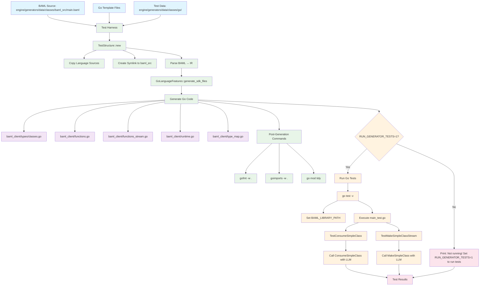

# BAML Generator Test Data Flow

## Key Components

### Input Files
- **BAML Source**: The main BAML file defining classes, functions, and tests
- **Go Templates**: Language-specific templates for code generation
- **Test Data**: Pre-existing Go test files and configuration

### Processing Pipeline
1. **Test Harness**: Orchestrates the entire test process
2. **IR Generation**: Converts BAML to Intermediate Representation
3. **Code Generation**: Uses templates to generate language-specific code
4. **Post-Processing**: Formats and tidies the generated code

### Generated Output
- **Type Definitions**: Go structs corresponding to BAML classes
- **Function Implementations**: Go functions for BAML functions
- **Streaming Support**: Streaming versions of functions
- **Runtime Integration**: Core BAML runtime code

### Test Execution
- **Conditional**: Only runs when `RUN_GENERATOR_TESTS=1`
- **Integration**: Tests generated code against actual LLM providers
- **Validation**: Ensures generated code works end-to-end
