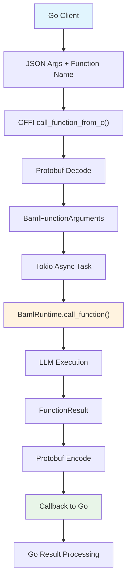
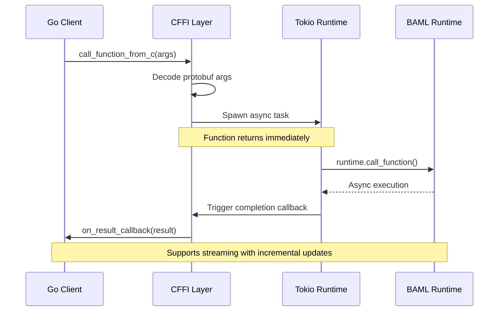
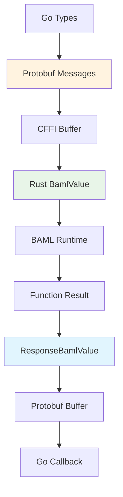

# Language Client CFFI Analysis

## Overview

The `language_client_cffi` component serves as a C Foreign Function Interface (FFI) bridge between the Rust-based BAML runtime engine and external language clients. It provides a stable C ABI that enables languages like Go to interact with BAML's core functionality for LLM function calls, type serialization, and runtime management.

## Architecture

### Component Structure
```
language_client_cffi/
├── src/
│   ├── lib.rs                 # Main FFI exports
│   ├── ffi/
│   │   ├── runtime.rs         # Runtime creation/destruction
│   │   ├── functions.rs       # Async function execution
│   │   └── callbacks.rs       # Callback registration system
│   ├── ctypes/                # Data serialization layer
│   │   ├── baml_value_encode.rs
│   │   ├── baml_value_decode.rs
│   │   └── function_args_decode.rs
│   ├── raw_ptr_wrapper.rs     # Memory-safe pointer management
│   └── panic/
│       └── ffi_safe.rs        # Panic-safe FFI wrappers
├── types/
│   └── cffi.proto             # Protobuf schema (351 lines)
├── build.rs                   # C header generation
├── cbindgen.toml             # C binding configuration
└── Cargo.toml                # crate-type = ["cdylib"]
```

### Key Entry Points

**Core FFI Functions** (`src/lib.rs:8-13`):
- `register_callbacks()` - Sets up async response callbacks
- `call_function_*()` - Executes BAML functions
- `create_baml_runtime()` - Creates runtime from configuration
- `destroy_baml_runtime()` - Cleanup and memory management

## Data Flow Illustration



## Async Execution Model



## Core Implementation Details

### 1. Runtime Management (`src/ffi/runtime.rs:20-66`)

```rust
pub extern "C" fn create_baml_runtime(
    root_path: *const libc::c_char,
    src_files_json: *const libc::c_char,  
    env_vars_json: *const libc::c_char,
) -> *const libc::c_void
```

**Key Operations:**
- Parses JSON strings for source files and environment variables (lines 32-42)
- Creates `BamlRuntime` instance (line 52)
- Returns raw pointer for cross-language compatibility (line 55)

### 2. Async Function Execution (`src/ffi/functions.rs:48-116`)

```rust
fn call_function_from_c_inner(
    runtime: *const libc::c_void,
    function_name: *const c_char,
    encoded_args: *const libc::c_char,
    length: usize,
    id: u32,
) -> Result<()>
```

**Execution Flow:**
- Decodes protobuf-serialized arguments using `BamlFunctionArguments::from_c_buffer()` (line 73)
- Spawns async task with Tokio runtime (line 80)
- Uses panic-safe execution with `catch_unwind()` (line 81)
- Triggers completion callback (line 112)

### 3. Data Serialization System



**Serialization Modules:**
- **Encoding**: `baml_value_encode.rs`, `baml_type_encode.rs` - Convert Rust → Protobuf
- **Decoding**: `baml_value_decode.rs`, `function_args_decode.rs` - Parse Protobuf → Rust
- **Protocol**: `types/cffi.proto:1-351` - Defines 35+ message types

### 4. Memory Management (`src/raw_ptr_wrapper.rs:30-99`)

**Safe Pointer Handling:**
- Wraps Rust objects in `RawPtrWrapper<T>` for cross-language safety
- Uses `Arc<T>` for reference counting and atomic persistence flags
- Supports 21 object types (collectors, media, type builders)
- Implements `Drop` trait for automatic cleanup (lines 93-99)

### 5. Callback System (`src/ffi/callbacks.rs:19-148`)

**Callback Types:**
- Result callbacks for function completion
- Error callbacks for failure handling
- Tick callbacks for streaming updates

**Implementation:**
- Uses `OnceCell` for thread-safe global callback storage (lines 11-17)
- Handles streaming vs non-streaming responses (lines 56-78)
- Panic-safe callback execution (lines 55-103)

## Build System Integration

### Cross-Platform Compilation (`build.rs:325-396`)

```rust
// Generate C headers
let config = cbindgen::Config::from_file("cbindgen.toml")
    .expect("Unable to find cbindgen.toml configuration file");
cbindgen::generate_with_config(&crate_dir, config)
```

**Build Tasks:**
- Uses `cbindgen` to generate C headers (lines 380-393)
- Generates Go protobuf bindings (lines 355-369)
- Creates header at `../language_client_go/pkg/cffi/baml_cffi_generated.h`

### Cargo Configuration

```toml
[lib]
crate-type = ["cdylib"]  # Builds as C dynamic library
```

### Make Integration (`Makefile.toml:13-59`)
- `cargo make go-sdk` - Complete Go SDK build pipeline
- Supports debug/release modes via `RELEASE_MODE` environment variable

## Integration Patterns

### 1. Factory Pattern for Object Creation
- `src/raw_ptr_wrapper.rs:144-193` - `RawPtrType::new_*()` methods
- Uses `#[export_baml_new_fn]` macro for consistent constructors

### 2. Repository Pattern for Type Management  
- `src/ctypes/function_args_decode.rs:9-15` - Centralizes argument parsing
- Abstracts complex protobuf deserialization

### 3. Async Callback Pattern
- Functions return immediately, execute asynchronously
- Thread-safe callback registry using `OnceCell`
- Supports streaming with incremental updates

## Go Client Integration

### Dynamic Library Loading
```go
// language_client_go/baml_go/lib.go:1-100
#cgo LDFLAGS: -ldl

func LoadLibrary() error {
    // Dynamic library discovery and loading
    // Version verification and compatibility checks
}
```

**Integration Points:**
- Go client dynamically loads CFFI library
- Uses cgo for C interop: `#cgo LDFLAGS: -ldl` (line 25)
- Handles library discovery and version verification (lines 83-100)

## Safety and Error Handling

### Memory Safety
- All FFI functions use `#[no_mangle]` and `extern "C"` for C ABI compatibility
- Raw pointers managed through `RawPtrWrapper` with atomic reference counting
- Panic boundaries prevent Rust panics from crossing FFI boundary

### Error Propagation
- Panic-safe wrappers in `src/panic/ffi_safe.rs:1-59`
- Error propagation via callbacks rather than return values
- Logging integration with `baml-log` and `env_logger`

### Version Compatibility  
- Version checking in `src/ffi/runtime.rs:8-16` ensures client/engine compatibility
- Build system generates platform-specific binaries with checksums

## Streaming Support

### Execution Modes
1. **Regular**: Single result callback
2. **Streaming**: Incremental callbacks with state management
3. **Parse-only**: Validation without execution

### Implementation
- Three callback types: result, error, and tick callbacks
- Streaming uses incremental updates via `on_event()` (line 317)
- State management for partial results and completions

## Dependencies

### Runtime Dependencies
- **baml-runtime**: Core execution engine with LLM calls
- **baml-types**: Type system and value representations  
- **tokio**: Async runtime for non-blocking execution
- **prost**: Protocol buffer serialization
- **libc**: C type compatibility

### Build Dependencies
- **cbindgen**: C header generation
- **prost-build**: Protobuf compilation
- **tonic-build**: gRPC service generation

## Summary

The `language_client_cffi` component is a critical bridge enabling BAML's multi-language support. It provides:

- **Stable C ABI** for cross-language compatibility
- **Async execution model** with callback-based completion
- **Memory-safe pointer management** with atomic reference counting
- **Comprehensive data serialization** via protobuf
- **Streaming support** for real-time LLM interactions
- **Panic-safe boundaries** preventing crashes across language boundaries

This architecture allows the Go client (and potentially other languages) to leverage the full power of the Rust-based BAML runtime while maintaining safety and performance.

## Q&A Session

### Q: If a user defines X.baml and Y.baml, would it result in different FFI layers?

**A:** No, the FFI layer is shared across all `.baml` files. Here's why:

The FFI layer receives **all** `.baml` files as a single JSON map in `src_files_json` at `src/ffi/runtime.rs:32-33`. The `BamlRuntime::from_file_content()` call processes all files together to create one unified runtime.

Key points:

1. **Single FFI Library**: The `language_client_cffi` builds one `.so`/`.dylib` file regardless of how many `.baml` files exist
2. **Unified Runtime**: All `.baml` files are parsed together into a single `BamlRuntime` instance
3. **Shared Functions**: Functions from X.baml and Y.baml are all accessible through the same `call_function_from_c()` interface
4. **Single Type System**: Types defined across all `.baml` files form one cohesive type system

The FFI layer is architecture-agnostic - it doesn't change based on BAML file content, only provides the bridge between languages and the unified BAML runtime.

### Q: What does the src_files_json look like for actual BAML files?

**A:** Here's an example based on the resume.baml and clients.baml files:

```json
{
  "resume.baml": "// Defining a data model.\nclass Resume {\n  name string\n  email string\n  experience string[]\n  skills string[]\n}\n\n// Create a function to extract the resume from a string.\nfunction ExtractResume(resume: string) -> Resume {\n  // Specify a client as provider/model-name\n  // you can use custom LLM params with a custom client name from clients.baml like \"client CustomHaiku\"\n  client \"openai/gpt-4o\" // Set OPENAI_API_KEY to use this client.\n  prompt #\"\n    Extract from this content:\n    {{ resume }}\n\n    {{ ctx.output_format }}\n  \"#\n}\n\n\n\n// Test the function with a sample resume. Open the VSCode playground to run this.\ntest vaibhav_resume {\n  functions [ExtractResume]\n  args {\n    resume #\"\n      Vaibhav Gupta\n      vbv@boundaryml.com\n\n      Experience:\n      - Founder at BoundaryML\n      - CV Engineer at Google\n      - CV Engineer at Microsoft\n\n      Skills:\n      - Rust\n      - C++\n    \"#\n  }\n}",
  "clients.baml": "// Learn more about clients at https://docs.boundaryml.com/docs/snippets/clients/overview\n\nclient<llm> CustomGPT4o {\n  provider openai\n  options {\n    model \"gpt-4o\"\n    api_key env.OPENAI_API_KEY\n  }\n}\n\nclient<llm> CustomGPT4oMini {\n  provider openai\n  retry_policy Exponential\n  options {\n    model \"gpt-4o-mini\"\n    api_key env.OPENAI_API_KEY\n  }\n}\n\nclient<llm> CustomSonnet {\n  provider anthropic\n  options {\n    model \"claude-3-5-sonnet-20241022\"\n    api_key env.ANTHROPIC_API_KEY\n  }\n}\n\n\nclient<llm> CustomHaiku {\n  provider anthropic\n  retry_policy Constant\n  options {\n    model \"claude-3-haiku-20240307\"\n    api_key env.ANTHROPIC_API_KEY\n  }\n}\n\n// https://docs.boundaryml.com/docs/snippets/clients/round-robin\nclient<llm> CustomFast {\n  provider round-robin\n  options {\n    // This will alternate between the two clients\n    strategy [CustomGPT4oMini, CustomHaiku]\n  }\n}\n\n// https://docs.boundaryml.com/docs/snippets/clients/fallback\nclient<llm> OpenaiFallback {\n  provider fallback\n  options {\n    // This will try the clients in order until one succeeds\n    strategy [CustomGPT4oMini, CustomGPT4oMini]\n  }\n}\n\n// https://docs.boundaryml.com/docs/snippets/clients/retry\nretry_policy Constant {\n  max_retries 3\n  // Strategy is optional\n  strategy {\n    type constant_delay\n    delay_ms 200\n  }\n}\n\nretry_policy Exponential {\n  max_retries 2\n  // Strategy is optional\n  strategy {\n    type exponential_backoff\n    delay_ms 300\n    multiplier 1.5\n    max_delay_ms 10000\n  }\n}"
}
```

The FFI layer receives all `.baml` files as a single JSON object where:
- **Keys**: File names (e.g., "resume.baml", "clients.baml") 
- **Values**: Complete file content as strings with escaped newlines

This unified approach means the FFI layer itself never changes - it always expects the same JSON structure regardless of BAML file content or count.