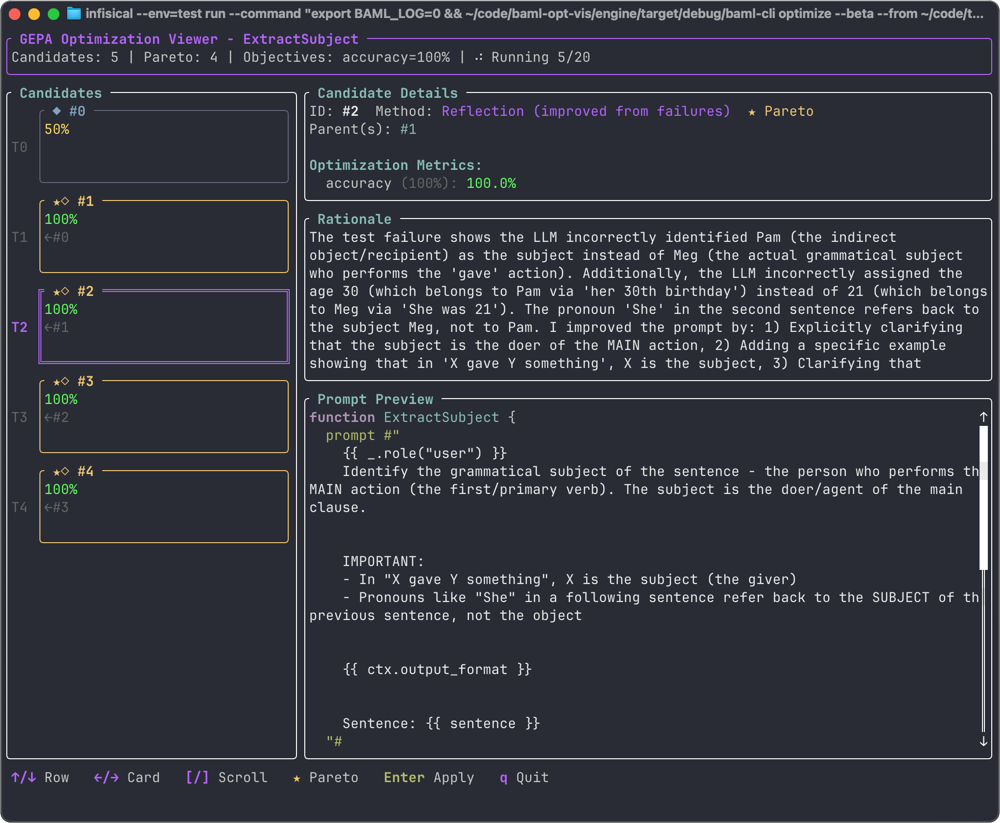

You can run an automatic Prompt optimization procedure to improve your
prompts. Prompt optimization uses the
[GEPA (Genetic Pareto)](https://arxiv.org/abs/2507.19457) algorithm
developed by the creators of [DSPy](https://dspy.ai).

# Optimizing test accuracy

To optimize a prompt, we have to indicate what makes the prompt
better or worse. The simplest way to do this is to write
[BAML Tests](/guide/baml-basics/testing-functions) that use asserts
to define the expected value.

To get started, [initialize a new project](/ref/baml-cli/init) or navigate
to an existing BAML project.

We will use the following code an an example prompt to optimize:

```baml
class Person {
  name string
  age int?
}

function ExtractSubject(sentence: string) -> Person? {
  client "anthropic/claude-sonnet-4-5"
  prompt #"
    {{ ctx.output_format }}
    
    Extract the subject from:
    {{ sentence }}
  "#
}

test EasyTest {
  functions [ExtractSubject]
  args {
    sentence "Ellie, who is 4, ran to Kalina's house to play."
  }
  @@assert( {{ this.name == "Ellie" }})
  @@assert( {{ this.age == 4 }} )
}

test HardTest {
  functions [ExtractSubject]
  args {
    sentence "Meg gave Pam a dog for her 30th birthday. She was 21."
  }
  @@assert( {{ this.name == "Meg" }})
  @@assert( {{ this.age == 21 }} )
}
```

Notice that we have two tests, each with two asserts. The key getting
good optimization results is to have lots of examples in the form
of tests. Use inputs that are similar to those you would see
in your app in production. This example only uses two because
we don't want to bloat the length of this guide.

Let's optimize the prompt's ability to pass the tests. 
From your project's root directory (usually the directory
containing your `baml_src` folder), run `baml-cli optimize`:

<Note>
You will need an ANTHROPIC_API_KEY in your environment,
because optimization uses Claude models by default.
</Note>

<CodeBlocks>
    ```bash title="TypeScript"
    pnpm exec baml-cli optimize --beta
    ```

    ```bash title="Python"
    uv run baml-cli optimize --beta
    ```
    
    ```bash title="Standalone"
    baml-cli optimize --beta
    ```
</CodeBlocks>

The `--beta` flag is required because Prompt Optimization is still
a beta feature. We will stabilize it after implementing more
features and collecting feedback.

While optimization is running, you will see textual user interface that
tracks the progress of the optimization.



The left panel shows the various candidate prompts and their accuracy
scores. The right side shows details about the selected candidate.
Select a candidate with the up/down arrows. The selected candidate
has an accuracy score, a rationale, and a new prompt. The new prompt
is generated by an LLM based on learnings from other prompts.
The accuracy score is computed by running the tests using the new prompt.
The rationale is the LLM's explanation of how it created the current
candidate prompt given the issues with previous prompts.

## Choosing a candidate

At any time during optimization, you can choose a candidate to
overwrite your current prompt. Select it with the up/down arrows
and press Enter. It's good practice to keep your prompt versioned,
so that you can revert any changes you don't like.

## Optimizing for multiple objectives

Test accuracy is the only thing we optimize by default, but you
may want to optimize additional metrics.
For instance, you might find that the default optimizer produces
accurate results but uses too many input tokens to encode the
instructions.

The following optimization will consider inputs tokens more
strongly than test accuracy, tending to produce much shorter
prompts, and using BAML features that shorten the descriptions
of schemas, such as removing descriptions and aliasing fields
to abbreviations.

```baml title="Objective weights"
baml-cli optimize --beta --weight accuracy=0.2,prompt_tokens=0.8
```

There are 5 builtin measures:

 - accuracy: Test pass fraction
 - prompt_tokens: Number of tokens in the prompt
 - completion_tokens: Number of tokens in the response
 - tokens: The sum of prompt and completion tokens
 - latency: Wall clock time to complete a response

You can also define custom metrics by using checks. Use the name
of the check as an objective in the `weights` flag.

In this example, we will use `check` instead of an `assert`, so
we can give it a name that we will later use to categorize it as
a custom weight. Again, writing multiple tests using the same check
name would result in more robust optimization for this metric.

```baml title="An additional test"
test MissingAge {
  functions [ExtractSubject]
  args {
    sentence "Bill spoke to the wall-facer"   
  }
  @@check(no_hallucination, {{ this.age == null }})
}
```

```bash title="Optimizing custom metrics"
baml-cli optimize --beta --weights accuracy=0.1,no_hallucination=0.9
```

## Customizing the optimization run

Prompt optimization makes several LLM calls in order to refine the prompt.
You can control the cost and the time of optimization by limiting the
number of trials in the search and the number of tests.

```bash title="Limiting optimization runs"
# Don't run more than 10 trials (10 candidates).
baml-cli optimize --beta --trials 10

# Don't run more than 50 tests, across all candidates.
baml-cli optimize --beta --max-evals 50

# Limit optimization to a single BAML function
baml-cli optimize --beta --function ExtractSubject

# Filter to specific tests
baml-cli optimize --beta --test "*::IndirectionTest"
```

Optimization runs generally start fresh from your own single
prompt. However, you can resume a prior optimization run,
adding more candidate prompts, using `--resume` followed by
the name of some prior run. Prior runs are tracked in the
optimization state directory, `.baml_optimize`.

```
# Resume an existing run
baml-cli optimize --beta --resume .baml_optimize/run_20251208_150606
```

## Customizing the algorithm

The GEPA optimization algorithm is implemented partially as BAML functions,
allowing you to customize it. These functions are installed into your
environment when you first run prompt optimization. If you
want to edit them before optimization starts, you can create
first, edit them, and then run optimization:

```sh
# Create the gepa.baml files but don't start optimization
baml-cli optimize --beta --reset-gepa-prompts

# ... edit .baml_optimize/gepa/baml_src/gepa.baml ...

# Run optimization with the customized gepa.baml
baml-cli optimize --beta
```

There are two safe ways to modify `gepa.baml`:

  1. Change the `client` field to use a model other
     than `openai/gpt-4`. For example, `anthropic/claude-opus-4-5`.
  2. Add text to the prompts for the functions named
     `ProposeImprovements`, `MergeVariants`, or
     `AnalyzeFailurePatterns`. These three functions constitute
     the LLM part of the GEPA algorithm.

It is not safe to change the classes or to delete text in `gepa.baml`
because the internal part of the implementation is not customizable,
and it expects the types to be in their current shape.

`gepa.baml` is defined like this:

```baml
/// Represents a class definition with its fields
class ClassDefinition { ... }

/// Represents an enum definition with value descriptions
class EnumDefinition { ... }

/// The complete optimizable context for a function
class OptimizableFunction { ... }

/// An example from test execution showing inputs, outputs, and feedback
class ReflectiveExample { ... }

/// The result of reflection: improved prompt and schema
class ImprovedFunction {
    prompt_text string
    classes ClassDefinition[]
    enums EnumDefinition[]
    rationale string
}

/// Analyze test failures and propose improvements to prompt and schema
function ProposeImprovements(
  current_function: OptimizableFunction,
  failed_examples: ReflectiveExample[],
  optimization_objectives: OptimizationObjectives?,
) -> ImprovedFunction {
    client ReflectionModel
    prompt ##"
        You are an expert at optimizing BAML functions. Your task is to improve
        both the prompt and the schema annotations based on the optimization objectives.

        ## Current Implementation

        Function: {{ current_function.function_name }}

        // ... Lots of instructions for how to improve prompts.

        {{ ctx.output_format }}
    "##
}

/// Analyze what types of failures are occurring
function AnalyzeFailurePatterns(
  function_name: string,
  failures: ReflectiveExample[]
) -> FailureAnalysis {
    client ReflectionModel
    prompt #"
        Analyze the failure patterns for function {{ function_name }}.

        ## Failures

        
        ### Failure {{ loop.index }}
        Inputs: {{ ex.inputs | tojson }}
        Output: {{ ex.generated_outputs | tojson }}
        Issue: {{ ex.feedback }}
        

        ## Your Task

        Categorize these failures and identify patterns:
        - Are failures due to prompt clarity issues?
        - Are they parsing/format problems?
        - Are they semantic understanding issues?
        - Are there common patterns across failures?

        {{ ctx.output_format }}
    "#
}

class FailureAnalysis {
    categories FailureCategory[]
    common_patterns string[]
    recommended_focus string
}

class FailureCategory {
    category string  // "prompt_clarity" | "parsing" | "semantic" | "edge_case" | "other"
    count int
    examples string[]
}
```

## Understanding the Optimization Algorithm

The sections above are enough to get started. But an understanding
of the GEPA algorithm can be helpful for getting better results
from optimization.

GEPA stands for Genetic Pareto, meaning that it proceeds by tracking
the current Pareto frontier, and combining prompts from the frontier
to try to extend the frontier. A Pareto frontier prompt is any prompt
that is not strictly worse than any other prompt, in the various ways
that prompts can be good or bad. For the simple case where only the
number of failing tests matters, the Pareto frontier is simply the
single prompt with the least failures (or the set of all prompts with
the least failures, if there is a tie).

The Pareto frontier begins with only your original prompt, and the algorithm
proceeds in a loop until it reaches its exploration budget (maximum
number of trials or maximum number of evaluations).

 1. Evaluate and score the current Pareto frontier (it starts with the initial prompt)
 2. Propose prompt improvements by iterating on or combining prompts on the frontier
 3. Reflect on the improved prompts and score them
 4. Repeat

## Limitations

### Types

Optimization will modify your types' descriptions and aliases, but it will
not make other changes, such as renaming or adding fields. Modifying
your types would require you to modify any application code that uses your
generated BAML functions.

### Template strings

When optimization runs over your functions, it only looks for the classes
and enums already used by that function. The optimizer doesn't know how
to search for template_strings in your codebase that would be helpful
in the prompt.

### Error types

For the purpose of optimization, all failures are treated
equally. If a model is sporadically unavailable and the LLM provider 
returns 500, this can confuse the algorithm because it will appear
that the prompt is at fault for the failure.

### Compound optimization

DSPy can optimize multiple prompts at once, when those prompts are
part of a larger workflow with workflow-level example input-output
pairs. BAML does not officially support workflows yet, so our
optimizations are limited to single prompts (single BAML functions).

## Future features

Based on user feedback, we are considering several improvements to
the prompt optimizer.

### Error robustness

We improve our error handling so that spurious errors don't penalize
a good prompt.

### Compound optimization

We will support optimizing workflows as soon as we support specifying.

### Agentic features

In some circumstances it would be helpful for the reflection steps
to be able to run tools, such as fetching specific documentation or
rendering the prompt with its inputs to inspect it prior to calling
the LLM.


## References

GEPA: https://arxiv.org/abs/2507.19457
DSPy: https://dspy.ai/
